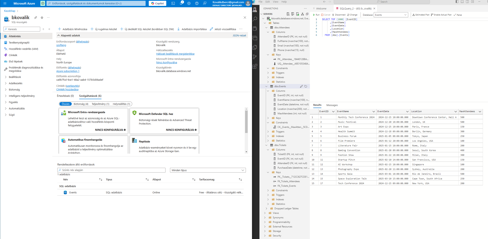
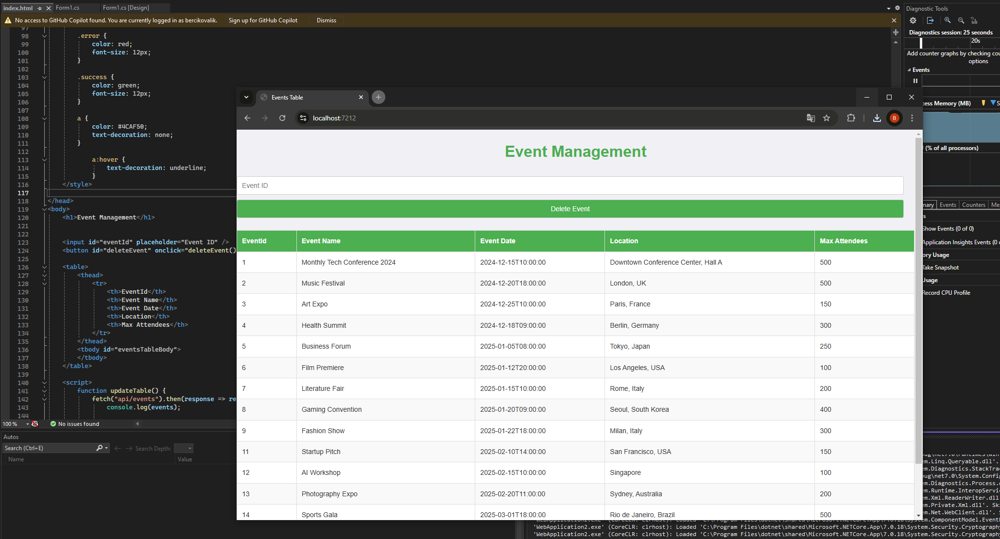
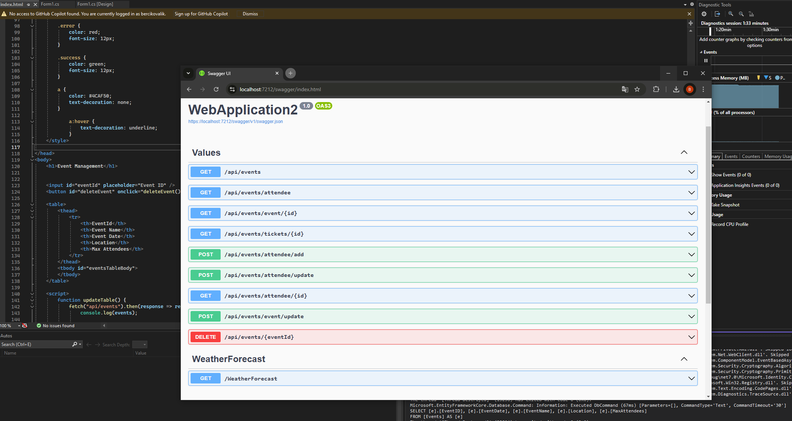
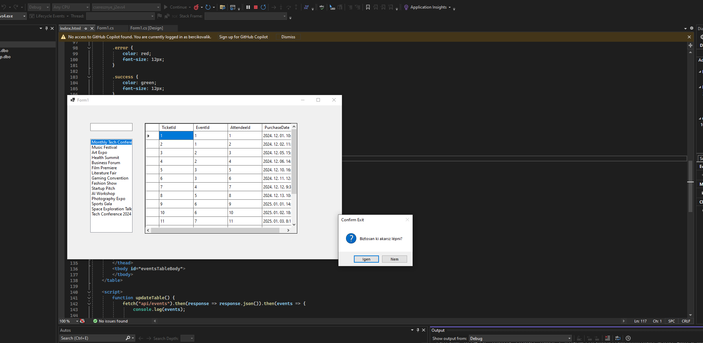
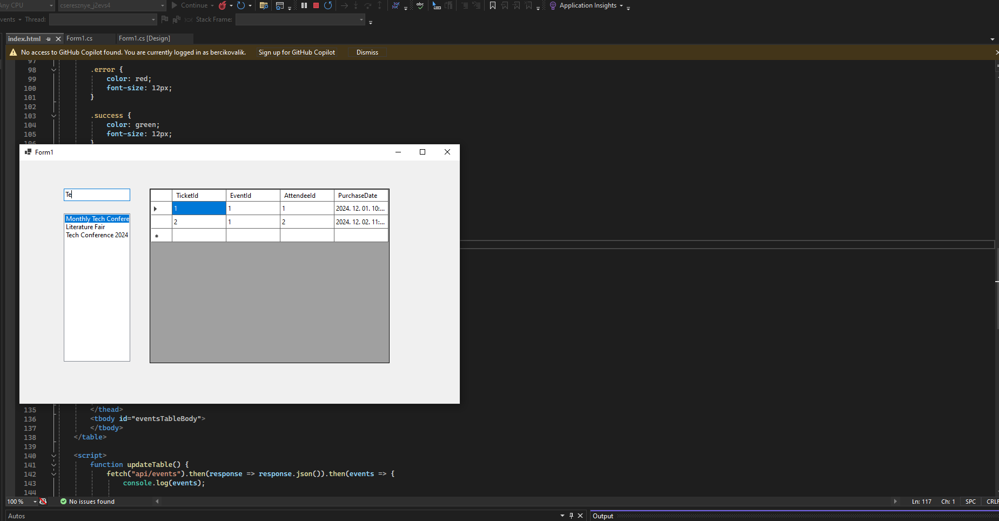

# Pontozólap 
Név: Kovalik-Deák Bercel    

Neptun: J2EVS4

## Projekt rövid leírása:
Egy egyszerű webapplikáció rendezvények nyilvántartására, Weboldallal és windows forms app-al.

## Hozott anyagok:

##### Saját Adatbázis

- `3x1p` Az alkalmazásban használt táblánként pont (Events, Attendees, Tickets)
- `1p` Az adatbázis tartalmaz Constraint-eket (min 2)
- `2p` Az adatbázis saját Azure SQL szerveren van
- `1p` Az adatbázis adatainak forrásmegjelölése értsd: miből készült és hogyan:
>Az adatbázishoz az SQL-t Azure Data Studio-ból töltöttem fel, SQL parancsokkal. A táblák ChatGPT által generált minta adatokkal vannak feltöltve. Az Events tábla tartalmazza az esemény nevét, dátumát, helyét és max látogatók számát. Az Attendees tábla a résztvevők nevét, email címét és telefonszámát tartalmazza. Végül a Tickets tábla az esemény Id-ját, a résztvevő Id-ját és a vásárlás dátumát tartalmazza.

Részösszeg: `7p`

##### Weboldal

- `1p` A weboldalnak van egy értelmezhető struktúrája
- `1p` A weboldal dinamikus tartalommal tölthető fel adatbázison keresztül
- `1p` A weboldal használ legalább 20 sor értelmes css-t
- `1p` A weboldal javascriptje más funkciót is ellát, mint az adatok betöltése (Törlés)

Részösszeg: `4p`
Eddig: `11p`

### Egyéb, extra

- `2x1p`  `Scaffold-DbContext` használata

Részösszeg: `2p`
Eddig: `13p`

### ASP .NET 

- `2p`  `program.cs` beállítása `wwwroot` mappában tárolt statikus tartalmak megosztására

Részösszeg: `2p`
Eddig: `15p`

##### API végpontok

- `3p` Teljes SQL tábla adatainak szolgáltatása API végponton keresztül (events)
- `2x2p` SQL tábla egy választható rekordjának szolgáltatása API végponton keresztül (events/event/{id},events/tickets/{id})
- `3p` SQL tábla egy választható rekordjának törlése (events/{eventId})
- `5p` Új rekord felvétele `HttpPost` metóduson keresztül SQL táblába (events/attendee/add)
- `2x3p` Rekord módosítása `HttpPost` metóduson keresztül SQL táblában (events/attendee/update, events/event/update)

Ha le szeretnék tesztelni az api metódusokat, használják a feltöltött SWAGGER_INPUT.txt file-ból a megfelelő inputot. Mivel bonyolult a kulcsok helyzete miatt a szerkezet, egyszerűbb az előre összeállított tesztet használni.

Részösszeg: `21p`
Eddig: `36p`

##### Javascript

## Windows Forms App

- `1x2p` Az alkalmazásból a kilépés csak megerősítő kérdés után lehetséges.
 
- `1x2p` Anchorok alkalmazása: az alkalmazás egészében meg van oldva, hogy az ablak átméretezésekor ki legyen használva a rendelkezésre álló terület.

Részösszeg: `4p`
Eddig: `40p`

### Tábla adatainak megjelenítése ListBox-ban.

- `1x2p` Adatok megjelenítése
- `1x2p` Ha az adatok tetszőleges módszerrel, pl. TextBox-on keresztül szűrhetőek.

Részösszeg: `4p`
Eddig: `44p`
 
### Tábla adatainak megjelenítése DataGridView-ban
- `1x2p` Adatok megjelenítése

Részösszeg: `2p`
Eddig: `46p`
 
### Adatkötés BindingSource -on keresztül
- `1x2p` Működő BindingSource

Részösszeg: `2p`

## Összessen: `48p`
